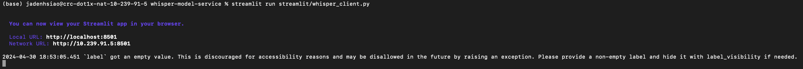

# DS219 LLM HW8

## Terminal Screenshot of LLM Server and Streamlit

## Screenshot of the Streamlit UI

## Notes and Chellenges

Overall, this was a fun mini project where I deployed my first ever LLM hosted on my local machine. 

First I made a clone of the repository, whisper-self-hosted-llm. The repository contained all the LLM models, streamlit UI, and sample audio files in order to run the LLM locally. Following the readme, I installed all the neccessary packages like streamlit and also downloaded a model from HuggingFace. After building my model through podman, I was able to deploy the LLM thorugh my terminal and access the streamlit UI. 

The biggest challenge I faced was running into Error 403 when trying to use a sample audio in streamlit. The problem took some time as well as some help from Aakanksha to solve. We found that the problem was with streamlit's version. We tested a older a version of streamlit (1.24.0) which worked and was able to transcribe the audio. We also found that the Japan audio file had some issues and did not work in our model. I also faced several small challenges like deploying the model locally. Using a Mac, I found that when deploying the LLM there were a couple minor changes to the podman run script in order to run successfully. 

I think it will be helpful to have tutorials based on different machines like windows, mac, and linux. Personally, I also want to know how different it would be to run tasks across different enivornments.

